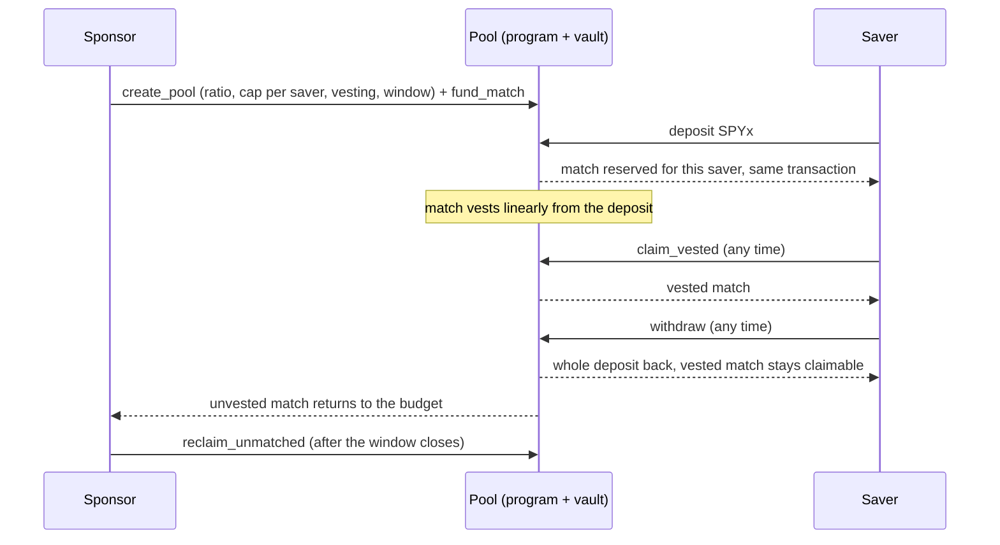

# AquaStock: Match Pools

**The employer match, for people without an employer.** A sponsor funds a match on what savers put into a tokenized S&P 500 stock (SPYx). The match is reserved on-chain the moment you deposit and vests in a straight line. Leave early and your whole deposit comes back, plus whatever has vested; the rest returns to the sponsor.

Built for [Stocklana](https://hackathons.solana.com/hackathons/stocklana) (Investing wedge). **Live on Solana devnet.**

| Try it                                                                                                        | Read it                                                      | Verify it                                                                                                                       |
| ------------------------------------------------------------------------------------------------------------- | ------------------------------------------------------------ | ------------------------------------------------------------------------------------------------------------------------------- |
| [App: open pools](https://aquastock-dapp.vercel.app/en/pools)                                                 | [Site](https://aquastock-tawny.vercel.app)                   | [Program `8wnj…3GXR`](https://explorer.solana.com/address/8wnjTUiMQaPxdgfgZdJUGAWBgdPqKoVUAtcWgpgs3GXR?cluster=devnet)          |
| [Standing demo pool](https://aquastock-dapp.vercel.app/en/pools/45K6H9DxvtYnmuXQDVjwFn3V4mgLbT3wYLBGfdfTHTSf) | [Program interface](docs/PROGRAM.md) · [API](docs/ROUTES.md) | [Demo token dSPYx `EHsn…kRtJ`](https://explorer.solana.com/address/EHsntaH73d7s3w84Saj8QGAm4Z6YCCx8v7ZeVEM5kRtJ?cluster=devnet) |

> **Demo — this does not constitute an offer of securities.** The program is unaudited. It runs on devnet with a replica of SPYx whose tokens have no value.

## Try it in two minutes

1. Switch your wallet to devnet. Phantom: Settings → Developer Settings → Testnet Mode → Solana Devnet. Solflare: Settings → Network → Devnet.
2. Open the [standing demo pool](https://aquastock-dapp.vercel.app/en/pools/45K6H9DxvtYnmuXQDVjwFn3V4mgLbT3wYLBGfdfTHTSf) ("Try it: 1:1 match, 10-minute vesting") and connect.
3. Press **Get demo tokens**. The app's faucet sends 100 dSPYx and 0.02 SOL for fees.
4. Deposit up to 100 dSPYx. The sponsor's 1:1 match is reserved for you in the same transaction.
5. Open **My match** and watch it vest over 10 minutes (a demo timescale; a real pool vests over months). Claim what has vested, or press **Withdraw** to see exactly what you keep and what goes back before you sign.

On a phone without a wallet extension, the connect dialog opens the page inside Phantom or Solflare. Anyone can also create a pool at [/pools/new](https://aquastock-dapp.vercel.app/en/pools/new) and fund it with demo tokens.

## The problem

An employer match is the best return most savers ever get, and it only exists if you have an employer. Since July 2026, US [Trump Accounts](https://home.treasury.gov/news/press-releases/sb0372) let an employer add up to $2,500 a year. Contractors, gig workers and savers outside the US get nothing like it, and the people who would happily sponsor them (a DAO paying global contributors, an NGO, a city, a relative abroad) have no rails to make a match that is enforceable, visible and fair to both sides.

## How it works



- **Deposit** reserves `min(amount × ratio, unreserved budget)` of match, first come first served, and reverts if that would be less than the preview the saver saw.
- **Vesting** is linear from the deposit over the pool's vesting period, read from the chain's clock.
- **Withdraw** always returns the whole principal. Only the unvested match is given up, and the app shows that number before you sign.
- **Deposit and match are the same mint in raw units**, so the ratio needs no price oracle and the issuer's dividend multiplier applies to both equally.

## Why Solana

- **The asset lives here.** xStocks such as SPYx are Token-2022 mints on Solana with a scaled-UI-amount multiplier (dividends and splits), pause, freeze and a permanent delegate. The program handles every one of those extensions, and refuses ones it could not hold safely, such as transfer fees.
- **Fees small enough for a $5 saver**, and markets that never close, so a match can vest and be claimed at 3 a.m. on a Sunday.
- **The rule is the product.** An employer match is a promise; here it is escrow and vesting enforced by a program, with every number readable on-chain.

## Honest about what you own

The pool page shows, read live from the mint: the issuer can pause transfers, freeze any account (including the pool's vault), move tokens out of any account, and change the display multiplier. The program cannot prevent that and says so. The program's upgrade authority is the team's deploy wallet, disclosed in the app and the FAQ. The operator console is read-only; no server key can touch a pool. The only server-side signer is the devnet faucet, which refuses to run on mainnet.

## Quality

- **Program:** 33 tests (vesting-math unit and property tests, and LiteSVM tests with 25 randomized operation sequences) against the mainnet Token-2022 build, asserting the accounting identities in [docs/PROGRAM.md](docs/PROGRAM.md) after every step: `claimed ≤ reserved ≤ budget_total`, `vault == budget_total − claimed + deposits_total`, rounding always in the pool's favour.
- **Deployed = source:** the devnet program is byte-identical to our `pnpm program:build` of this repo (Anchor 1.2.0, Agave 4.1.2, Rust 1.95.0, SBPF v0): `solana program dump -u devnet 8wnjTUiMQaPxdgfgZdJUGAWBgdPqKoVUAtcWgpgs3GXR live.so && sha256sum live.so` gives `d69d1b010fcb65facdf081843984a71bfe45305d154076dcdf1cbd991aa705cf`. A different toolchain may not reproduce it bit for bit; a verified build (`solana-verify`) is not set up.
- **App:** 395 unit and route tests (Vitest), a Playwright golden path on desktop and a 390 px phone viewport against a local validator, en/es parity enforced by a test, `pnpm check` (format, lint, typecheck, test, build) as the gate.
- **Live:** `pnpm demo:preflight` checks the deployed app the way a judge meets it (faucet, pool budget, database, price, pages, repo). `pnpm demo:preflight --live` also runs a real faucet → deposit → claim → withdraw → close round trip on devnet with a throwaway wallet.

## Architecture

| Path         | What it is                                                                                                                                                                                                                     |
| ------------ | ------------------------------------------------------------------------------------------------------------------------------------------------------------------------------------------------------------------------------ |
| `programs/`  | Anchor 1.2 program (Rust): `Config`, `Pool`, `Position` and a vault; `init_config`, `create_pool`, `fund_match`, `deposit`, `claim_vested`, `withdraw`, `reclaim_unmatched`, `close_position`. Interface in `docs/PROGRAM.md`. |
| `apps/dapp`  | The product (Next.js): pools, deposit, claim, withdraw with a forfeiture preview, the sponsor's create-pool wizard, My match, a read-only operator console, and the API route handlers (`docs/ROUTES.md`).                     |
| `apps/web`   | The marketing site (Next.js, en/es).                                                                                                                                                                                           |
| `packages/*` | Shared UI primitives, locales, config, animation, API types and the program's typed IDL, and the Prisma schema.                                                                                                                |

The chain is the source of truth for every number. Postgres (Prisma) holds only pool names, signed by the sponsor's wallet, and an activity feed the server re-reads from the chain before recording. Prices come from Pyth (Hermes, `Crypto.SPYX/USD`) and are shown only as "≈ $" next to token amounts.

## Run it locally

```bash
pnpm install
pnpm dev:stack     # Postgres, a local validator, a demo pool, a test wallet, and the app on :3003
```

Open <http://localhost:3003/en/pools> and choose "E2E Test Wallet". No keys of yours and no real network are involved. Needs Docker and the Solana/Anchor toolchain; see [docs/SETUP.md](docs/SETUP.md).

| Command               | Does                                                                     |
| --------------------- | ------------------------------------------------------------------------ |
| `pnpm check`          | Format, lint, typecheck, test and build, workspace-wide                  |
| `pnpm program:test`   | Build the program (SBPF v0) and run its unit, property and LiteSVM tests |
| `pnpm program:smoke`  | The whole product flow on a local validator                              |
| `pnpm test:e2e`       | Playwright on desktop and phone viewports against `pnpm dev:stack`       |
| `pnpm demo:preflight` | Check the live deployment; `--live` for a real devnet round trip         |

## Prior work and open-source components

- AquaStock is built by the team behind DDPay (contact: admin@ddpay.io). The monorepo scaffold (build tooling, shared config and generic UI primitives) was adapted on 2026-09-13 from our earlier DDPay codebase. Commits from 2026-09-13 to 2026-09-18 belong to an earlier AquaStock concept (water-project co-funding) that this build replaced. The Match Pools program, API, product UI, marketing site and docs were written from 2026-09-19 for Stocklana.
- Built on open-source software: Anchor, `@solana/web3.js`, `@solana/spl-token`, Solana wallet-adapter (Wallet Standard), Next.js, React, next-intl, Tailwind CSS, Base UI, Prisma, Better Auth, zod, `@upstash/ratelimit`, Motion, GSAP, OGL, cobe, Vitest, Playwright and LiteSVM. Market data from Pyth Network. The marketing site's photographs are AI-generated illustrations.
- The team's decisions and open risks are in [docs/PIVOT_PLAN.md](docs/PIVOT_PLAN.md); the demo script and judge Q&A are in [docs/DEMO_SCRIPT.md](docs/DEMO_SCRIPT.md).
